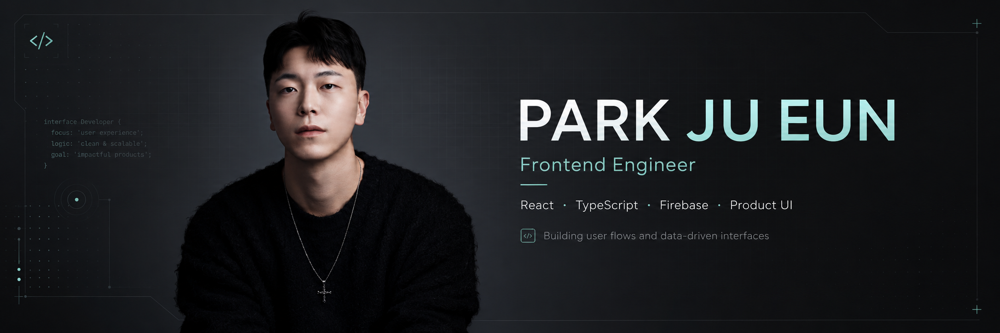

<div align="center">



<br />

# 박주은 · Frontend Engineer

**사용자 흐름과 데이터 흐름을 실제 서비스 형태로 연결하는 프론트엔드 개발자입니다.**

<br />

[](https://pjewep.vercel.app)
&nbsp;
[](mailto:pje698112@naver.com)

</div>

---

## 🛠 Tech Stack

<div align="center">

| 영역 | 기술 |
| :---: | :--- |
| **Frontend** |      |
| **Backend / DB** |     |
| **AI / API** |  |
| **Design** |   |
| **Deploy** |   |

</div>

---

## 📁 Projects

### 🐾 PetLog
> AI OCR 기반 반려동물 병원비 기록 서비스

영수증을 업로드하면 AI가 항목을 분석하고, 사용자가 검토·수정한 데이터만 저장합니다.
AI 결과를 그대로 신뢰하지 않고 사람이 확인하는 **Human-in-the-loop 구조**로 설계했습니다.

| | |
|---|---|
| **Live App** | [petlog-eight.vercel.app](https://petlog-eight.vercel.app/) |
| **소개서** | [petlogwep.vercel.app](https://petlogwep.vercel.app/) |
| **GitHub** | [github.com/rhazns22/petlog](https://github.com/rhazns22/petlog) |

**구현 흐름**
```
영수증 업로드 → 이미지 최적화 → Gemini OCR 분석
→ 항목 분류 (진찰 / 검사 / 처치 / 수술 / 약제)
→ 사용자 검토 & 수정 → Firestore 저장 → PDF 리포트 생성
```

**핵심 기술 선택**
- `Gemini 2.5 Flash` — 영수증 항목 추출 및 의료비 6대 분류
- `Firebase Auth + Firestore` — 사용자별 독립 데이터 관리
- `compressionRatio / avgConfidence` — OCR 품질 지표 추적

<br />

### 🏛 Chaengim
> 맞춤형 정부 혜택 탐색 및 신청 관리 PWA

사용자 프로필(나이·지역·소득·취업 상태)을 기반으로 혜택을 추천하고,
신청 준비 상태와 마감 일정을 한 곳에서 관리하는 **풀스택 PWA**입니다.

| | |
|---|---|
| **Live App** | [chaengim.vercel.app](https://chaengim.vercel.app/) |
| **소개서** | [chaengimweb.vercel.app](https://chaengimweb.vercel.app/) |
| **GitHub** | [github.com/rhazns22/chaengim](https://github.com/rhazns22/chaengim) |

**구현 흐름**
```
프로필 입력 → Rule-based 1차 필터링
→ Gemini API 맞춤 추천 보고서 생성 (적합성 점수 / 추천 이유 / 유의점)
→ 관심 혜택 저장 → 칸반 보드 관리 → D-Day 일정 모니터링
```

**핵심 기술 선택**
- `Express + Prisma + MySQL` — Type-safe REST API 및 DB 구조 설계
- `JWT + Zod + Helmet` — 인증, 런타임 검증, 보안 헤더 적용
- `Railway` — 백엔드 서버 배포, `Vercel` — 프론트엔드 배포

<br />

### 📄 Portfolio Website
> 프로젝트 경험을 Notion 문서형 모달로 정리한 개인 포트폴리오

| | |
|---|---|
| **Live** | [pjewep.vercel.app](https://pjewep.vercel.app) |
| **Stack** | HTML5 · Vanilla CSS · Vanilla JS · Lenis · Vercel |

기술 스택 필터 그리드, 프로젝트 Notion 모달, 쫀득한 스크롤 인터랙션을  
외부 프레임워크 없이 순수 Vanilla로 구현했습니다.

---

## 💡 Engineering Philosophy

```
문제를 구조화한다
  └ 사용자가 겪는 불편함을 기능 단위와 화면 흐름으로 정리합니다.

데이터 흐름을 연결한다
  └ 입력 → 검증 → 저장 → 결과 출력까지의 흐름을 직접 설계합니다.

AI를 도구로 사용한다
  └ AI 결과를 그대로 신뢰하지 않고, 테스트와 검증을 거쳐 반영합니다.
```

---

<div align="center">
  <sub>© 2026 Jueun Park · Built with HTML, CSS, JS</sub>
</div>