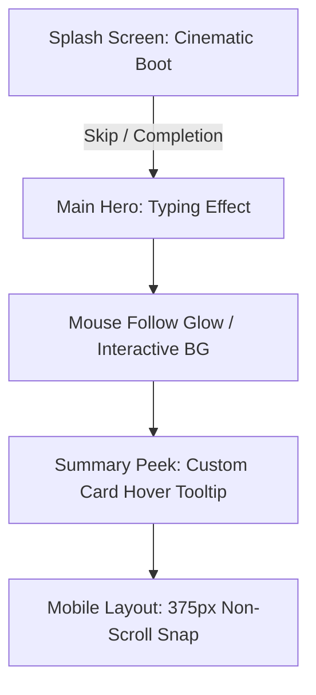

# ⚡ PRODUCT-MINDED FRONTEND ENGINEER PORTFOLIO

<div align="center">
  

  <p align="center">
    <strong>사용자 흐름과 데이터 연결을 안정적으로 구현하는 프론트엔드 엔지니어, 박주은입니다.</strong>
  </p>

  <p align="center">
    <a href="https://pjewep.vercel.app"></a>
  </p>

  <p align="center">
    
    
    
    
    
    
  </p>
</div>

---

## 💡 Engineering Philosophy & Value

단순한 화면 그리기를 넘어, **기획과 UI 설계부터 실시간 API 데이터 연동, 그리고 최종 프로덕션 배포까지의 모든 엔지니어링 사이클**을 조망합니다. 

* 🔍 **문제를 구조화하기**: 사용자가 겪는 불편함을 기능 요구사항 및 화면 이동 흐름 단위로 명확히 분석합니다.
* 🎨 **디자인을 UI 코드로 구현하기**: 시각적인 완성도는 기본, 프론트엔드의 컴포넌트 재사용성과 렌더링 최적화를 고려해 화면을 설계합니다.
* 📦 **데이터 흐름 연결하기**: Firebase Auth, Firestore, MySQL, Gemini API를 부드럽게 결합하여 살아 숨쉬는 기능 서비스를 완성합니다.

---

## 🛠️ Tech Stack & Capability

| Category | Skills & Tools | Level & Criteria |
| :--- | :--- | :--- |
| **Frontend** | React, TypeScript, HTML5, CSS3, JavaScript | 컴포넌트 기반 UI 재사용성 극대화, 타입 기반의 안전한 인터페이스 정의 |
| **Backend Integration** | Firebase (Auth / Firestore / Storage), MySQL | 회원가입/로그인 흐름, 사용자 데이터베이스 실시간 CRUD 흐름 완벽 제어 |
| **AI API** | Gemini API Integration | OCR 분석 초안 가공, 에러 핸들링 및 검토 시점 제어 흐름 설계 |
| **Design** | Figma, Photoshop, Illustrator | 사용자 인터랙션 설계, 반응형 미디어 쿼리 구축, 프로토타이핑 |
| **DevOps / Workflow** | Vercel, Git, ChatGPT, Antigravity | CD 파이프라인 자동화, AI 협업 코딩(Vibe Coding)을 활용한 신속한 오류 해결 |

---

## 🚀 Main Projects

### 🐾 1. PetLog (AI 기반 병원비 기록 및 분석 서비스)
> 영수증 한 장으로 끝나는 반려동물 병원비 스마트 관리 파이프라인

* 🔗 **Live App**: [PetLog 바로가기](https://petlog-eight.vercel.app/) / **Project Web**: [PetLog 상세 설명 웹](https://petlogwep.vercel.app/)
* 🛠️ **Core Flow**:
  1. 사용자 영수증 업로드 ➡️ Gemini OCR을 활용한 세부 내역 실시간 파싱
  2. 수기 입력 Fallback UI를 탑재하여 AI 오인식 시에도 원활한 기록 지원
  3. Firebase Firestore 저장 전, 사용자가 확인하고 수정할 수 있는 안정적인 데이터 검토 단계 구현

---

### 🏥 2. VetFlow (동물병원 SaaS형 통합 대시보드)
> 동물병원의 실시간 진료 상태와 워크플로우를 모니터링하는 전문 Console

* 🔗 **Live Demo**: [VetFlow 바로가기](https://vetflow-pi.vercel.app/)
* 🛠️ **Core Flow**:
  1. 역할 기반(진료의, 접수처, 관리자) 권한 제어 및 화면 뷰 가변 처리
  2. 미처리 및 대기 환자의 타임라인을 실시간 상태 동기화로 모니터링
  3. 복잡한 데이터를 심플하고 명확한 HUD 스타일 레이아웃 대시보드로 시각화

---

## ✨ Interactive Design Features

포트폴리오 자체에 구현된 **Premium 인터랙티브 모듈**들은 웹 완성도를 높여 면접관들에게 강렬한 첫인상을 남깁니다.



* 🎬 **Cinematic Boot Splash Sequence**: `sessionStorage` 기반 1회 노출 처리, 부드러운 캔버스 파티클 효과와 스킵 키(ESC/Enter) 연동.
* 🔭 **Cursor Reading Lens & Action Circle**: 텍스트를 읽을 때 눈을 편안하게 해주는 커스텀 렌즈 필터 효과와 인터랙티브 마우스 글로우.
* 💬 **Summary Peek Tooltip**: 카드 마우스 오버 시 주요 이력을 구조화된 텍스트로 밀리초 단위 팝업으로 제공.
* 📱 **Perfect Mobile Optimization**: 375px 모바일 장치에서도 단 1픽셀의 가로 스크롤도 발생하지 않는 안전한 CSS Flex/Grid 레이아웃.

---

## 📁 Directory Structure

```bash
pje-portfolio/
├── index.html       # 제품 지향적 프론트엔드 포지셔닝 구조 설계
├── style.css        # 다크테크 감성 디자인 시스템 및 글래스모피즘
├── script.js        # 부드러운 캔버스 파티클 및 마우스 인터랙션 제어
├── assets/          # 스크린샷 배너 및 벡터 이미지 리소스
└── README.md        # 프로젝트 메인 기술서
```

---
<div align="center">
  <strong>Developed with Passion & Precision by 박주은</strong>
</div>
